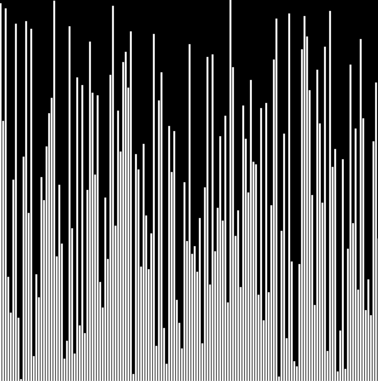

# 比较排序

## 交换排序

### 冒泡排序 bubbleSort

### 快速排序 quickSort

时间复杂度为O(nlog2n)，空间复杂度为O(log2n)。

## 选择排序

### 简单选择排序

# 非比较排序

## 计数排序 countingSort

时间复杂度为Ο(n+k)（其中k是整数的范围），空间复杂度为O(k)。

使用情况：

1. 用于排序大于等于0的整数。
2. 取值在一定范围内。（当O(k)>O(n*log(n))时其效率不如基于比较的排序）
3. 取值比较集中。（不然浪费空间）

## 桶排序 bucketSort

